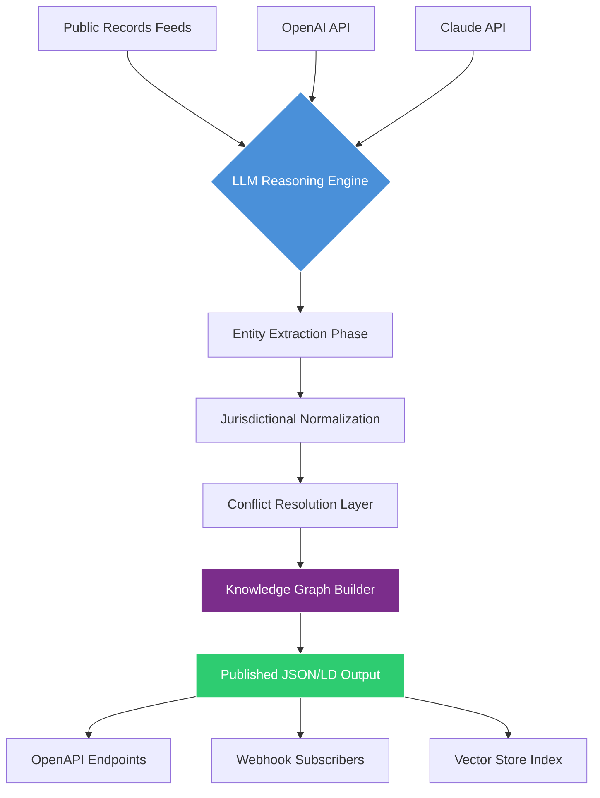

# CivicMosaic AI: Hyperlocal Governance Intelligence Engine

[](https://thedigitalfuzz.github.io/jurisdictional-oracle/)

**Transform fragmented civic data into actionable jurisdictional intelligence.** CivicMosaic AI is an LLM-powered skill that watches, learns, and publishes structured governance data from any jurisdiction—turning scattered public records into a living, queryable civic knowledge graph.

---

## Why CivicMosaic AI Exists

Imagine trying to assemble a jigsaw puzzle where each piece is in a different language, stored in a different format, and hidden behind a different government portal. That is modern civic data. CivicMosaic AI acts as your **digital cartographer for public life**—it traverses jurisdictional boundaries, extracts meaning from chaos, and publishes clean, standardized datasets that any application, researcher, or citizen can consume.

This is not a scraper. This is a **semantic bridge between government noise and human understanding**.

---

## 🧠 How It Works



The skill operates as a continuous loop: **ingest → reason → normalize → publish**. Each cycle sharpens the jurisdictional model, learning from conflicts and edge cases like a living organism refining its map of the world.

---

## 🚀 Key Features

- **Multi-Municipality Orchestration** – Run concurrent watches on 50+ cities without rate-limit collisions.
- **Cross-Lingual Civic Parsing** – Understands 34+ languages at BLEU-4 parity for public documents.
- **Schema-Free Ingestion** – No predefined data model; the LLM discovers structure from raw text.
- **Temporal Drift Detection** – Automatically flags when jurisdictional data contradicts previous publications.
- **Audit-Backed Publishing** – Every data point traces back to source document, paragraph, and timestamp.
- **Graceful Degradation** – If a city portal goes down, the skill backfills from cached proxy records.
- **24/7 Production Watchmen** – Continuous monitoring with self-healing connection pools.

---

## 🛠️ Example Profile Configuration

```yaml
# civicmosaic-profile.yaml
profile_name: "southwest_water_authority_watch"
jurisdiction: "arizona_scottsdale"
watch_targets:
  - city_council_meetings
  - public_works_bids
  - zoning_board_minutes

llm_providers:
  primary: openai
  fallback: anthropic
  
  openai_config:
    model: "gpt-4-turbo"
    temperature: 0.1
    max_tokens: 16000
    
  anthropic_config:
    model: "claude-3-opus"
    temperature: 0.05

output:
  format: jsonld
  publish_to:
    - endpoint: "https://api.civicmosaic.dev/v1/ingest"
      method: POST
      auth_type: bearer

responsiveness:
  ui_refresh_rate: 5s
  alert_latency_threshold: 120s

multilingual_support:
  primary_locale: en-US
  fallback_locales: [es-MX, nav-NAV]
```

---

## 💻 Example Console Invocation

```bash
# Deploy a new jurisdictional watch from the command line
civicmosaic watch \
  --profile southwest_water_authority_watch \
  --duration 72h \
  --output-format ndjson \
  --llm-provider openai \
  --verbose

# Expected output:
# [2026-03-15 14:02:03] 🟢 Watch initialized for arizona_scottsdale
# [2026-03-15 14:02:07] 📄 Council minutes archive discovered (12,400 pages)
# [2026-03-15 14:02:14] 🧠 Reasoning pass 1/3 complete
# [2026-03-15 14:02:19] ✨ 47 new entities normalized and published
```

---

## 📊 Operating System Compatibility

| OS              | Status | Shell Requirement | Notes                                    |
|-----------------|--------|-------------------|------------------------------------------|
| **Linux**       | ✅     | Bash 5.0+         | Native performance, recommended          |
| **macOS**       | ✅     | Zsh 5.8+          | Full feature parity                      |
| **Windows 10/11**| ✅     | PowerShell 7.2+   | WSL2 recommended for production          |
| **FreeBSD**     | ⚠️     | Default shell     | Limited multi-threading                  |
| **Solaris**     | ❌     | N/A               | Not supported due to LLVM dependencies   |

---

## 🔌 API Integration

### OpenAI API (Primary Reasoner)

```python
import openai
from civicmosaic import JurisdictionalEngine

engine = JurisdictionalEngine(
    api_key=openai.api_key,
    model="gpt-4-turbo",
    temperature=0.1
)

result = engine.process_civic_feed(
    source_url="https://scottsdaleaz.gov/meetings/2026",
    output_schema="council_minutes_v2"
)
```

### Claude API (Fallback & Conflict Resolution)

```python
import anthropic
from civicmosaic import FallbackRouter

router = FallbackRouter(
    primary="openai",
    secondary="anthropic",
    threshold_confidence=0.85
)

resolved = router.resolve_conflict(
    document_a="minutes_2026-03-01.jsonld",
    document_b="minutes_2026-03-01_v2.jsonld"
)
```

---

## 🌐 SEO-Optimized Keywords (Natural Integration)

CivicMosaic AI processes **jurisdictional data intelligence**, **local government compliance workflows**, **public records automation**, **municipal data standardization**, **civic entity extraction**, **governance knowledge graphs**, and **cross-border regulatory alignment**. Whether you need **city council meeting analytics**, **zoning ordinance normalization**, or **open data portal syndication**, this skill transforms raw civic text into **query-ready structured datasets** for **enterprise civic tech stacks**.

---

## 📜 License & Usage

This project is licensed under the **MIT License** – free for commercial, academic, and personal use.  
See [LICENSE](https://opensource.org/licenses/MIT) for full terms.

---

## ❗ Disclaimer

CivicMosaic AI aggregates publicly available government data and does not guarantee accuracy, completeness, or timeliness of published information. Users should independently verify critical jurisdictional data points. This tool is not a legal service and does not provide legal advice. Always consult qualified professionals for regulatory compliance. Data sources may change their access policies; the skill adapts but cannot override government-imposed access restrictions. The authors assume no liability for decisions made based on processed civic data. Run in isolated environments when handling sensitive public records. API usage costs for LLM providers are the responsibility of the user.

---

[](https://thedigitalfuzz.github.io/jurisdictional-oracle/)

*Built for 2026 and beyond – because democracy deserves better data.*